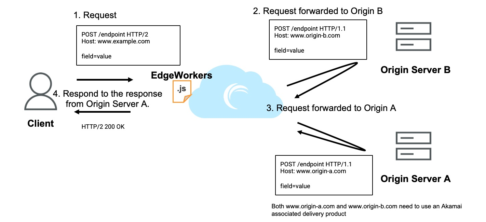
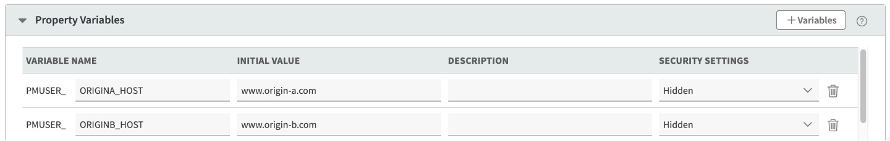

# clone-request-example

*Keyword(s):* request, route 
*[Since](https://learn.akamai.com/en-us/webhelp/edgeworkers/edgeworkers-user-guide/GUID-14077BCA-0D9F-422C-8273-2F3E37339D5B.html):* 1.0

This example will clone request to two origin servers.

## Usage Examples
    // Incoming Request
    POST / HTTP/1.1
    Host: www.example.com
    
    field=value

    // Request forwarded to Origin A
    POST / HTTP/1.1
    Host: www.origin-a.com
    
    field=value

    // Request forwarded to Origin B
    POST / HTTP/1.1
    Host: www.origin-b.com
    
    field=value

## Diagram

## Property Variable

## Similar Uses
Similar logic could be used to send the same POST data to two diffrent origin servers. 

## Resources
See the repo [README](https://github.com/akamai/edgeworkers-examples#Resources) for additional guidance.

## Contributors
Shubham Verekar